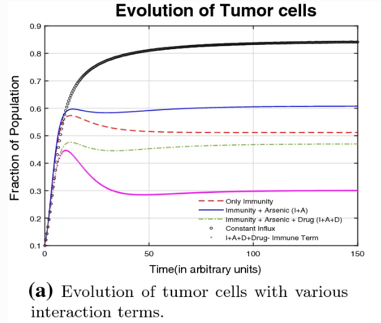



## Selected works

### Effect of correlated disorder on superconductivity in a kagome lattice: A Bogoliubov–de Gennes analysis

**R. Kiran**, Sudipta Biswas and Monodeep Chakraborty
  _Effect of correlated disorder on superconductivity in a kagome lattice: A Bogoliubov–de Gennes analysis_
  PhysRevB.110.184506 [[article]](https://journals.aps.org/prb/abstract/10.1103/PhysRevB.110.184506)
  [[researchgate]](https://www.researchgate.net/publication/385637326_Effect_of_correlated_disorder_on_superconductivity_in_a_kagome_lattice_A_Bogoliubov-de_Gennes_analysis)

This paper investigates the superconducting properties of a two-dimensional s-wave
superconductor on a kagome lattice subjected to correlated disorder. Using the
Bogoliubov–de Gennes theory, we analyze the impact of disorder correlations on
superconducting behavior. Additionally, we derive the stiffness formula for the
kagome lattice and calculate its superfluid stiffness. An intriguing finding of
our paper is the bimodal characteristic in the probability distribution of the
superconducting pairing amplitude at higher disorder correlation strengths for
intermediate values of the disordered potential. Our results provide valuable
insights into how disorder correlations influence superconductivity and underscore
the role of lattice geometry in shaping superconducting properties.

### Immunomodulatory role of black tea in the mitigation of cancer induced by inorganic arsenic

**R. Kiran**, Swati Tyagi, Syed Abbas, Madhumita Roy and A. Taraphder 
  _Immunomodulatory role of black tea in the mitigation of cancer induced by inorganic arsenic_
  Eur. Phys. J. Plus (2020) 135: 735 [[article]](https://link.springer.com/article/10.1140%2Fepjp%2Fs13360-020-00766-1)
  [[arxiv]](https://arxiv.org/abs/2005.13489) 

We present a model analysis of the tumor and normal cell growth under the influence of a carcinogenic 
agent, an immunomdulator (IM) and variable influx of immune cells including relevant interactions. 
The tumor growth is facilitated by carcinogens such as inorganic 
arsenic while the IM considered here is black tea (Camellia sinesnsis). The model with variable 
influx of immune cells is observed to have considerable advantage over the constant influx model, 
and while the tumor cell population is greatly mitigated, normal cell population remains
above healthy levels. The evolutions of normal and tumor cells are computed from the proposed model
and their local stabilities are investigated analytically. Numerical simulations are performed to
study the long term dynamics and an estimation of the effects of various factors is made. 
This helps in developing a balanced strategy for tumor mitigation without the use of chemotherapeutic 
drugs that usually have strong side-effects

### Population Migration and COVID  

**R. Kiran**, Madhumita Roy, Syed Abbas and A. Taraphder 
  _Effect of population migration and punctuated lockdown on the spread of infectious diseases_
  Nonauton. Dyn. Syst. 2021; 8:251-266 [[article]](https://www.degruyter.com/document/doi/10.1515/msds-2020-0137/html)
  [[arxiv]](https://arxiv.org/abs/2006.15010) 

One of the critical measures to control infectious diseases is a lockdown. Once past the lockdown 
stage in many parts of the world, the crucial question now concerns the effects of relaxing the 
lockdown and finding the best ways to implement further lockdown(s), if required, to control the spread.
With the relaxation of lockdown, people migrate to different cities and enhance the spread of the disease. 
This work presents the population migration model for n-cities and applies the model for migration
between two and three cities. The reproduction number is calculated, and the effect of the migration 
rate is analyzed. A punctuated lockdown is implemented to simulate a protocol of repeated lockdowns 
that limits the resurgence of infections. A damped oscillatory behavior is observed with multiple peaks 
over a period.

### Possible realization of hyperbolic plasmons in a few-layered rhenium disulfide

**R. Kiran**,Dimitar Pashov, Mark van Schilfgaarde, Mikhail I. Katsnelson, A. Taraphder, Swagata Acharya
_Possible realization of hyperbolic plasmons in a few-layered rhenium disulfide_
 [[arxiv]](https://arxiv.org/abs/2301.06521)  

 The in-plane structural anisotropy in low-symmetric layered compound rhenium disulfide 
 ($\text{ReS}_2$) makes it a candidate to host and tune electromagnetic phenomena specific for 
 anisotropic media. In particular, optical anisotropy may lead to the appearance of hyperbolic 
 plasmons, a highly desired property in optoelectronics. The necessary condition is a strong 
 anisotropy of the principal components of the dielectric function, such that at some frequency 
 range, one component is negative and the other is positive, i.e., one component is metallic, 
 and the other one is dielectric. Here, we study the effect of anisotropy in $\text{ReS}_2$ and 
 show that it can be a natural material to host hyperbolic plasmons in the ultraviolet frequency 
 range. The operating frequency range of the hyperbolic plasmons can be tuned with the number of 
 $\text{ReS}_2$ layers.
